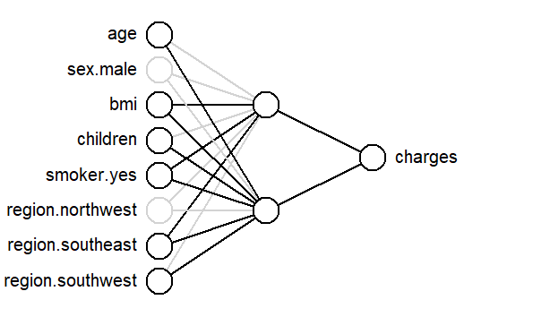

```{r, echo=FALSE, message=FALSE}
library(knitr)
library(fontawesome)
# the default output hook
hook_output <- knit_hooks$get('output')
knit_hooks$set(output = function(x, options) {
  if (!is.null(n <- options$out.lines)) {
    n <- as.numeric(n)
    x <- unlist(stringr::str_split(x, "\n"))
    nx <- length(x) 
    x <- x[pmin(n,nx)]
    if(min(n) > 1)  
      x <- c(paste(options$comment, "[...]"), x)
    if(max(n) < nx) 
      x <- c(x, paste(options$comment, "[...]"))
    x <- paste(c(x, "\n"), collapse = "\n")
  }
  hook_output(x, options)
    })
```

```{r, echo = FALSE}
library(interpretnn)
```


```{r analysis, include=FALSE, cache=TRUE}

# load packages -----------------------------------------------------------
library(interpretnn)
library(caret)
library(selectnn)

set.seed(1)

# load data ---------------------------------------------------------------
insurance <- read.csv("insurance.csv",
                      stringsAsFactors = TRUE)

dummy <- dummyVars(" ~ .", data = insurance)
insurance <- data.frame(predict(dummy, newdata = insurance)) 


# prep data --------------------------------------------------------

std_X <- caret::preProcess(insurance[, c(1, 4, 5)])

std_y <- caret::preProcess(data.frame("charges" = insurance[, 12]))

X <- as.matrix(predict(std_X, insurance[, c(1, 4, 5)]))
X <- cbind(X, insurance[, c(3, 7, 9:11)])
X <- X[, c(1, 4, 2, 3, 5, 6:8)]
y <- as.matrix(predict(std_y, data.frame("charges" = insurance[, 12])))
df <- as.data.frame(cbind(X, y))

# selectnn ----------------------------------------------------------------
set.seed(2)
nn <- selectnn(charges ~ ., data = df, Q = 8, n_init = 5)
summary(nn)


interpretnn.default <- function(object, B = 100, ...) {
  
  stnn <- interpretnn(object$nn, X = object$x, y = object$y, B = B)
  
  return(stnn)
}

# interpretnn -------------------------------------------------------------

n_init <- 10
q <- 2 # achieves VC that is positive definite

lambda <- 0.0001


inn <- nn_fit(X, y, q, n_init, maxit = 2000, lambda = lambda)

intnn <- interpretnn.default(inn)

summary(intnn, wald_single_par = TRUE)
```

class: title-slide, left, bottom

# `r rmarkdown::metadata$title`
----
## **`r rmarkdown::metadata$author`**, **`r rmarkdown::metadata$coauthor`**
### `r rmarkdown::metadata$institution`
#### `r rmarkdown::metadata$event`, `r rmarkdown::metadata$date`

---

# Introduction

```{r, echo=FALSE, out.width="40%", fig.align="center"}
knitr::include_graphics(c("img/limerick-map.png"))
``` 


---
# Background

--

*  Ph.D. student since 2020

--

*  Research: Neural networks from a statistical-modelling perspective


--

```{r, echo=FALSE, out.width="70%", fig.align="center"}
knitr::include_graphics(c("img/packages.png"))
``` 


---
class: selectnn-slide
# Model Selection


```{r, echo=FALSE, out.width="90%", fig.align="center"}
knitr::include_graphics("img/modelsel.png")
``` 

A Statistically-Based Approach to Feedforward Neural Network Model Selection (arXiv:2207.04248)

---
class: selectnn-slide
# Insurance: Model Selection 


```{r selection, echo = TRUE, eval = FALSE, out.width="30%"}
library(selectnn)
nn <- selectnn(charges ~ ., data = insurance, Q = 8,
               n_init = 5)
summary(nn)
```

--

```{r summ, echo = FALSE, cache = TRUE, class.output = "bg-primary"}
cat(c("[...]", capture.output(summary(nn))[c(4:7, 10:14)], "[...]"), sep = "\n") 
```

---

class: interpretnn-slide
# Interpreting FNNs

Extend packages: **nnet**, **neuralnet**, **keras**, **torch** 

*  Significance testing

*  Covariate-effect plots 

---

class: interpretnn-slide
# Insurance: Model Summary 


```{r, message = FALSE, eval = FALSE, tidy = FALSE}
intnn <- interpretnn(nn)  
summary(intnn)
```

--

```{r summst, echo = FALSE, cache = TRUE, class.output = "bg-primary"}
s <- summary(intnn, wald_single_par = TRUE)$coefdf
s[, 5] <- round(s[, 5], 4)


cat(c(capture.output(summary(intnn))[9],
      capture.output(print(s[, c(1, 7, 4, 5, 6)], row.names = FALSE)),
      capture.output(summary(intnn))[20:21])
    , sep = "\n")

```

---

class: interpretnn-slide
# Insurance: Model Summary 


```{r, message = FALSE, eval = FALSE, tidy = FALSE}
plotnn(intnn)
```

--

```{r, echo=FALSE, out.width="70%", fig.align="center"}

``` 

---

class: interpretnn-slide
# Insurance: Covariate Effects 


```{r, eval = FALSE}
plot(intnn, conf_int = TRUE, which = c(1, 4))
```  

--

.pull-left[ 
```{r plot1, cache = TRUE, echo = FALSE, fig.height = 6}
par(mar=c(5,6,4,2)+.1) 
plot(intnn, which = 1, conf_int = TRUE, ylim = c(0, 0.5), cex.axis = 1.7,
     cex.caption = 2.5, cex.lab = 2.2)
```  
]  

--

.pull-right[ 
```{r plot2, cache = TRUE, echo = FALSE, fig.height = 6}
par(mar=c(5,6,4,2)+.1) 
plot(intnn, which = 4, conf_int = TRUE, ylim = c(0, 0.5), cex.axis = 1.7,
     cex.caption = 2.5, cex.lab = 2.2)
```  
] 
---
class: bigger
# References

*  McInerney, A., & Burke, K. (2022). A statistically-based approach to feedforward neural network model selection. arXiv preprint arXiv:2207.04248.    

*  McInerney, A., & Burke, K. (2023). Interpreting feedforward neural networks as statistical models. In Preparation.    


### R Package  

```{r, eval = FALSE}
devtools::install_github(c("andrew-mcinerney/selectnn",
                           "andrew-mcinerney/interpretnn"))
```


`r fa(name = "github", fill = "#007DBA")` <font size="5.5">andrew-mcinerney</font>   `r fa(name = "twitter", fill = "#007DBA")` <font size="5.5">@amcinerney_</font> `r fa(name = "envelope", fill = "#007DBA")` <font size="5.5">andrew.mcinerney@ul.ie</font>


